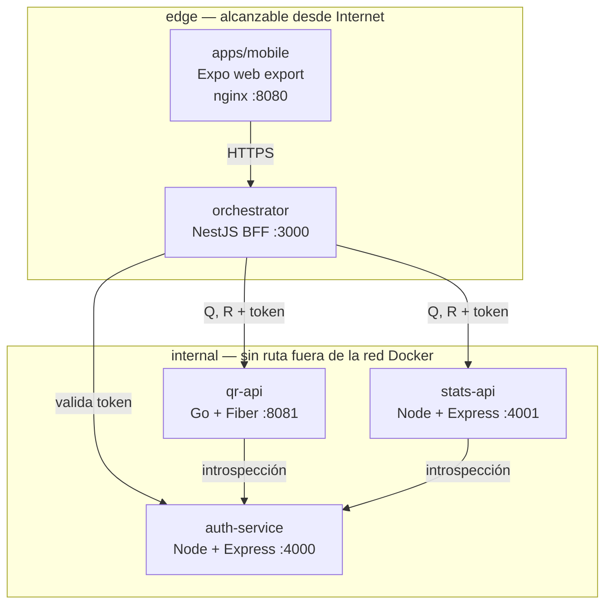
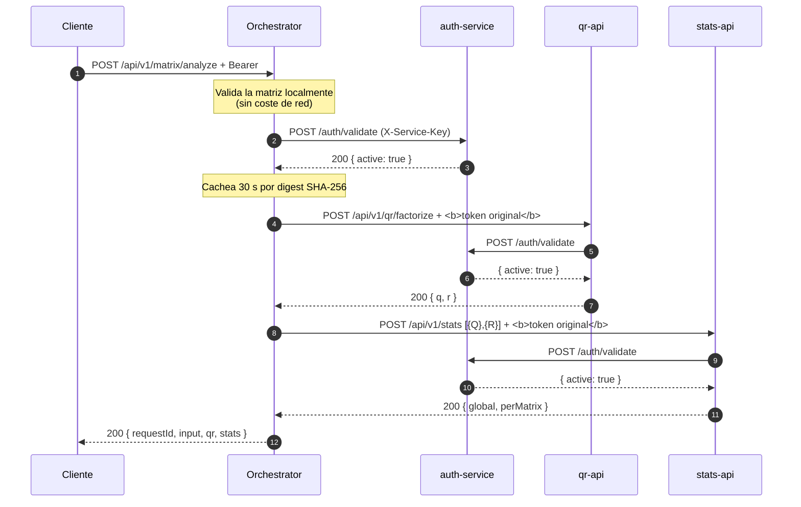

# Interseguro QR Analyzer

Factorización QR de matrices rectangulares con sus estadísticas, servida por
cinco contenedores y una app Expo.

- **Factorización QR completa**: `A (m×n) = Q (m×m) · R (m×n)`, con `Q`
  ortogonal y `R` triangular superior, calculada con reflectores de
  Householder implementados a mano.
- **Estadísticas** (máximo, mínimo, media, suma, ¿es diagonal?) sobre `Q` y `R`,
  con suma compensada de Neumaier.
- **Autenticación real**: JWT firmados con RS256, introspección contra un
  servicio de autenticación independiente y *fail closed*.
- **Aislamiento de red**: de los cinco servicios, sólo dos son alcanzables desde
  fuera.

---

## Índice

1. [Arquitectura](#arquitectura)
2. [Puesta en marcha](#puesta-en-marcha)
3. [Endpoints](#endpoints)
4. [Variables de entorno](#variables-de-entorno)
5. [Calidad](#calidad)
6. [Despliegue en la nube](#despliegue-en-la-nube)
7. [Decisiones](#decisiones)
8. [Estructura del repositorio](#estructura-del-repositorio)
9. [Limitaciones conocidas](#limitaciones-conocidas)

---

## Arquitectura



La regla que explica el diagrama: **el front no conoce ningún backend salvo el
orquestador**, y **los tres backends no se conocen entre sí**. Cada uno tiene una
sola responsabilidad y valida el token del cliente por su cuenta, sin confiar en
que el orquestador ya lo haya hecho.

El flujo de `POST /api/v1/matrix/analyze`:



### Puertos publicados

Sólo dos. Los tres backends viven en una red marcada `internal: true`, que no
tiene salida a Internet, y `scripts/smoke.sh` lo comprueba.

| Servicio | Puerto publicado | Comprobado por el smoke test |
|---|---|---|
| `mobile-web` | 8080 | — |
| `orchestrator` | 3000 | accesible |
| `auth-service` | **ninguno** | cerrado |
| `qr-api` | **ninguno** | cerrado |
| `stats-api` | **ninguno** | cerrado |

---

## Puesta en marcha

Requisitos: Docker con Compose v2, Go ≥ 1.23 y Node ≥ 22 (probado con 24).

```bash
git clone <repo> && cd interseguro

cp .env.example .env          # configuración, sin secretos
./scripts/gen-dev-keys.sh     # par RSA de desarrollo + credenciales demo
docker compose up --build --wait
```

`gen-dev-keys.sh` escribe `.env.dev-keys`, que `docker-compose.yml` monta
**sólo** en `auth-service`. No hay que concatenar nada a `.env`: el fichero de
secretos se pasa por `env_file`, y los signos `$` del hash argon2id van
duplicados (`$$`) porque Compose interpola también los valores de `env_file`.

| | |
|---|---|
| Front | <http://localhost:8080> |
| API | <http://localhost:3000> |
| Swagger | <http://localhost:3000/docs> |
| Credenciales | `demo` / `demo-password` |

```bash
make up      # levantar y esperar a que esté sano
make test    # las cinco suites
make lint    # lint + typecheck de los cinco
make smoke   # prueba de extremo a extremo contra el stack en marcha
```

### Desarrollo local sin Docker

```bash
make deps

# en cuatro terminales, con las variables de .env exportadas
cd services/qr-api      && go run ./cmd/qr-api
cd services/stats-api   && npm run dev
cd services/auth-service && npm run dev
cd services/orchestrator && npm run dev

# el front, en un quinto
cd apps/mobile && EXPO_PUBLIC_API_URL=http://localhost:3000 npx expo start
```

`docker-compose.override.yml` se aplica automáticamente con `docker compose up`
y publica además los puertos internos (4000, 4001, 8081) para poder depurar. No
se usa en ningún entorno desplegado, y por eso `make smoke` se ejecuta contra el
compose sin override: la comprobación de aislamiento de red sólo es real si los
puertos internos están cerrados.

---

## Endpoints

Todo lo que no sea el orquestador es interno. Contratos OpenAPI 3.1 completos en
[`contracts/`](contracts/).

### Público — orquestador

```bash
# Login
curl -s -X POST http://localhost:3000/auth/login \
  -H 'Content-Type: application/json' \
  -d '{"username":"demo","password":"demo-password"}'
# → {"accessToken":"eyJ...","tokenType":"Bearer","expiresIn":900}

TOKEN=$(curl -s -X POST http://localhost:3000/auth/login \
  -H 'Content-Type: application/json' \
  -d '{"username":"demo","password":"demo-password"}' \
  | python3 -c 'import sys,json; print(json.load(sys.stdin)["accessToken"])')

# Analizar una matriz
curl -s -X POST http://localhost:3000/api/v1/matrix/analyze \
  -H 'Content-Type: application/json' \
  -H "Authorization: Bearer $TOKEN" \
  -H 'X-Request-Id: mi-traza-1' \
  -d '{"matrix":[[12,-51,4],[6,167,-68],[-4,24,-41]]}'
```

Respuesta (recortada):

```json
{
  "requestId": "mi-traza-1",
  "input": { "rows": 3, "cols": 3 },
  "qr": {
    "q": [[-0.857143, 0.394286, -0.331429],
          [-0.428571, -0.902857, 0.034286],
          [0.285714, -0.171429, -0.942857]],
    "r": [[-14, -21, 14], [0, -175, 70], [0, 0, 35]]
  },
  "stats": {
    "global": { "max": 70, "min": -175, "average": -5.2178, "sum": -93.92,
                "anyDiagonal": false },
    "perMatrix": [
      { "id": "Q", "max": 0.394286, "min": -0.942857, "average": -0.324444,
        "sum": -2.92, "isDiagonal": false },
      { "id": "R", "max": 70, "min": -175, "average": -10.1111,
        "sum": -91, "isDiagonal": false }
    ]
  }
}
```

### Tabla de endpoints

| Método | Ruta | Puerto | Auth | Devuelve |
|---|---|---|---|---|
| `POST` | `/auth/login` | 3000 | no | token (`Bearer`, 900 s) |
| `POST` | `/api/v1/matrix/analyze` | 3000 | sí | QR + estadísticas agregadas |
| `GET` | `/health/live` · `/health/ready` | 3000 | no | `{"status":"ok"}` |
| `GET` | `/docs` | 3000 | no | Swagger UI |
| `POST` | `/auth/login` | 4000 | no | token (interno) |
| `POST` | `/auth/validate` | 4000 | `X-Service-Key` | RFC 7662 (interno) |
| `GET` | `/.well-known/jwks.json` | 4000 | no | JWKS |
| `POST` | `/api/v1/qr/factorize` | 8081 | sí | `{q, r}` |
| `POST` | `/api/v1/stats` | 4001 | sí | estadísticas |

### Códigos de error

Todos los errores son **RFC 9457** (`application/problem+json`) e incluyen el
`requestId`, que es la misma traza que aparece en los logs de los cuatro
servicios.

| Código | Cuándo | `type` |
|---|---|---|
| `400` | cuerpo que no es JSON, o sobre sin `matrix` | `malformed-request` |
| `401` | token ausente, alterado, expirado o inválido | `unauthorized` |
| `413` | matriz por encima del límite, o cuerpo demasiado grande | `payload-too-large` |
| `422` | matriz presente pero inválida (irregular, vacía, no finita) | `invalid-matrix` |
| `429` | límite de peticiones superado | `rate-limited` |
| `502` | un backend respondió con error o no responde | `bad-gateway` |
| `503` | **auth-service inalcanzable**: no se pudo verificar el token | `service-unavailable` |
| `504` | un backend no respondió a tiempo | `gateway-timeout` |

La distinción entre `401` y `503` es la más importante de la tabla. Un `401`
significa "vuelve a autenticarte"; un `503` significa "no he podido
comprobarlo". Confundirlos convierte una caída de `auth-service` en un bucle
infinito de re-login del que el sistema no puede salir solo.

Un `422` nombra exactamente el problema, porque es lo que el usuario puede
arreglar:

```json
{
  "type": "https://interseguro.local/problems/invalid-matrix",
  "title": "Invalid matrix",
  "status": 422,
  "detail": "row 1 has length 2, expected 3",
  "instance": "/api/v1/matrix/analyze",
  "requestId": "0c2f..."
}
```

---

## Variables de entorno

`.env.example` documenta todas. Sólo merecen una explicación:

| Variable | Por qué |
|---|---|
| `SERVICE_API_KEYS` | Credencial compartida que los backends presentan en `X-Service-Key` al introspeccionar. Separada por comas; comparación en tiempo constante. |
| `JWT_PRIVATE_KEY_PEM` | **Sólo la recibe `auth-service`.** Los otros cuatro contenedores no ven la clave privada. Se lee de `env_file`, no de `environment`, porque Compose interpola `$` en ambos. |
| `AUTH_CACHE_TTL_SECONDS` | Latencia máxima de revocación (30 s). También es el TTL máximo de la caché de introspección, siempre acotado por el `exp` del token. |
| `MAX_MATRIX_DIM` | El orquestador lo aplica **antes** de cualquier llamada de red, para no gastar un viaje en un rechazo previsible. |
| `DIAGONAL_EPSILON` | Tolerancia de la bandera "diagonal" (`1e-9`). Ver [ADR-004](docs/adr/004-diagonal-definition.md). |
| `CORS_ORIGINS` | Lista explícita, nunca `*`: el orquestador es el único backend público, así que su política CORS es la del sistema entero. |
| `API_URL` | Se inyecta en `/config.json` al arrancar el contenedor del front, para que una misma imagen sea promovible entre entornos sin reconstruir. |

Todo se valida **al arrancar**, con un mensaje que nombra la variable. Una
configuración absurda es un fallo de arranque, no un error raro bajo carga.

---

## Calidad

### Puertas de calidad

```bash
make test    # 5 suites
make lint    # go vet + gofmt, tsc + eslint en los cuatro servicios Node
make verify  # las tres cosas por servicio (en services/*)
```

| Suite | Tests | Qué protege |
|---|---|---|
| `qr-api` | 62 | algoritmo (23 tablas), aplicación, HTTP, caché de tokens, config |
| `stats-api` | 157 | suma compensada, diagonal, validación, mapeo de errores HTTP |
| `auth-service` | 128 | login, introspección, ataques JWT clásicos, credenciales |
| `orchestrator` | 154 | workflow, clasificación de errores, e2e contra servidores reales |
| `mobile` | 81 | validación, mapeo de errores del cliente, editor de matrices |
| **total** | **582** | |

Cobertura: 98 % en `stats-api`, 90 % en `auth-service`, 88 % en `orchestrator`,
100 % en el dominio de `stats-api` y en el workflow del orquestador (umbrales
definidos en `vitest.config.ts` y **fallan la build** si bajan).

### Quéfindings

El smoke test no es decorativo. Encontró **dos bugs que ninguna prueba unitaria
podía haber detectado**, porque sólo aparecen cuando los servicios se hablan de
verdad:

1. **`qr-api` y `stats-api` no reenviaban la cabecera `Authorization` a
   `auth-service`.** El cliente de introspección construía la petición con la
   credencial de servicio pero **sin el token**, así que la autoridad respondía
   `{"active": false}` para *todo* token, y cada llamada devolvía `401`. Parece
   un fallo de autenticación y no lo es. Ambos clientes tienen ahora una prueba
   de regresión que comprueba la cabecera.
2. **El orquestador clasificaba errores de axios con `instanceof`.** Cuando
   `@nestjs/axios` resuelve su propia copia de axios, el error lanzado **no es
   una instancia** de la clase importada. La comprobación fallaba en silencio,
   todo error parecía "sin respuesta", y un `401` se traducía a `503`. Ahora se
   comprueba la forma (`isAxiosError`), que no depende de la identidad de clase.

También se corrigió un botón del editor de matrices que seguía siendo pulsable
en su mínimo y no hacía nada, detectado por una prueba de componente.

### Los tres invariantes numéricos

`scripts/smoke.sh` no se conforma con comprobar que el endpoint devuelve 200.
Comprueba las tres propiedades que definen una factorización QR:

```
residual     = ||Q·R − A||_max / ||A||_max   → 2.8e-14   (umbral 1e-9)
ortogonalidad= ||Qᵀ·Q − I||_max               → 6.7e-16   (umbral 1e-9)
triangularidad= Entries per sota el diagonal de R → 0 exacto
```

Un `200` con números plausibles pero erróneos no pasa. Es la comprobación que un
revisor puede ejecutar y fiarse.

### Tamaño de las imágenes

| Imagen | Tamaño | Nota |
|---|---|---|
| `qr-api` | **9,8 MB** | `distroless/static`: binario estático, sin shell |
| `mobile-web` | 49,5 MB | nginx + export estático |
| `auth-service` | 173 MB | `node:22-alpine` + dependencias de producción |
| `stats-api` | 179 MB | ídem |
| `orchestrator` | 240 MB | ídem, con el framework completo |

`qr-api` es unas veinte veces más pequeño que los demás porque no lleva ni sistema base
ni runtime de JavaScript. Los servicios Node llevan `node_modules` de
producción únicamente (`npm ci --omit=dev`), pero el runtime de Node y el código
transpilado pesan.

### Endurecimiento

- Contenedores como usuario no root, `read_only: true`, `cap_drop: [ALL]`,
  `no-new-privileges`, `tmpfs` donde hace falta escritura.
- `tini` como PID 1 en las imágenes Node, para que SIGTERM llegue al proceso y
  el apagado sea ordenado. `docker-compose` **no** activa `init: true`, porque
  eso anidaría dos tini.
- `maxRedirects: 0` en el orquestador: un redirect desde un servicio interno
  sería un error de configuración o un intento de alcanzar algo que no debe.
- `helmet` en las tres superficies HTTP, y `x-powered-by` desactivado.
- El `X-Request-Id` entrante se **valida** antes de usarse: sin eso, un `\n` en
  la cabecera permitiría falsificar líneas de log.

---

## Despliegue en la nube

Objetivo: **Azure Container Apps**, IaC en Bicep.

```bash
az bicep install
bicep build deploy/main.bicep --stdout > /dev/null   # valida
az deployment group create -g <rg> -f deploy/main.bicep -p @params.json
```

Tres backends con `external: false` (inalcanzables desde Internet por
construcción, no por una regla de firewall) y dos apps con ingress externo.
Los secretos son referencias a Key Vault y el registro tiene
`adminUserEnabled: false`.

> **La infraestructura está validada pero no ejecutada.** `deploy/main.bicep`
> compila sin errores ni advertencias y el ARM generado ha sido revisado, pero
> nunca se ha aplicado contra una suscripción real. No existe ninguna URL
> desplegada. Ver [`deploy/README.md`](deploy/README.md), que además lista lo
> que falta para un despliegue de verdad (TLS, zona, red privada del vault).

---

## Decisiones

Los ADRs están en [`docs/adr/`](docs/adr/), en español.

| ADR | Decisión |
|---|---|
| [001](docs/adr/001-qr-vs-rotation.md) | Factorización **QR completa**, no una rotación: el enunciado dice "las matrices" en plural y `A = Q·R` es verificable |
| [002](docs/adr/002-orchestrator-driven-flow.md) | El orquestador posee el flujo, en vez de Go → Node, para que los servicios no se conozcan entre sí |
| [003](docs/adr/003-householder-and-tolerances.md) | Householder sobre Gram-Schmidt; convención de signos de LAPACK, sin normalizar la diagonal |
| [004](docs/adr/004-diagonal-definition.md) | "Diagonal" con tolerancia `1e-9`, porque la salida de QR trae ceros que son `1e-16` |
| [005](docs/adr/005-token-validation.md) | Introspección a un servicio aparte, con caché corta, *fail closed* y token propagado sin transformar |
| [006](docs/adr/006-no-database.md) | Sin base de datos: usuarios desde el entorno, detrás de un puerto de una línea |
| [007](docs/adr/007-token-storage-mobile.md) | `expo-secure-store` en nativo, memoria + `sessionStorage` en web, **nunca** `localStorage` |
| [008](docs/adr/008-cloud-target-and-deployment-strategy.md) | Azure Container Apps, porque el sistema ya es un conjunto de contenedores sin estado |

La chuleta de una página para la entrevista está en
[`docs/INTERVIEW.md`](docs/INTERVIEW.md).

---

## Estructura del repositorio

```
.
├── contracts/              OpenAPI 3.1, escritos ANTES que el código
│   ├── auth-service.yaml     y validados en CI (@redocly/cli)
│   ├── qr-api.yaml
│   ├── stats-api.yaml
│   └── orchestrator.yaml
├── services/
│   ├── qr-api/             Go + Fiber
│   │   ├── cmd/qr-api/main.go
│   │   └── internal/
│   │       ├── domain/qr/        algoritmo puro: Matrix + Householder
│   │       ├── application/      caso de uso + puertos (sin framework)
│   │       ├── adapters/http/    Fiber, problem+json, middleware
│   │       ├── adapters/authclient/  introspección + caché
│   │       └── config/
│   ├── stats-api/          Node + Express + TypeScript
│   │   └── src/
│   │       ├── domain/         stats.ts: suma compensada, diagonal
│   │       ├── application/     validación + caso de uso
│   │       └── adapters/
│   ├── auth-service/       Node + Express + jose + argon2
│   └── orchestrator/       NestJS (BFF)
├── apps/mobile/            Expo + Expo Router (iOS, Android y web)
├── deploy/                 main.bicep + README
├── docs/
│   ├── adr/                8 decisiones
│   └── INTERVIEW.md        chuleta de una página
├── scripts/
│   ├── smoke.sh            verificación de extremo a extremo
│   └── gen-dev-keys.sh     claves RSA + hash argon2id de desarrollo
├── docker-compose.yml      dos redes; sólo 2 puertos publicados
└── Makefile
```

Cada servicio sigue la misma forma, con las dependencias apuntando hacia
dentro:

```
domain/         lógica pura: ni I/O, ni framework, ni configuración
application/    casos de uso + puertos (interfaces)
adapters/       HTTP, clientes, cripto, configuración
```

Una consecuencia práctica: `AnalyzeWorkflow` es una clase de TypeScript sin un
solo decorador de Nest, así que sus 35 pruebas corren sin contenedor. Y el
`domain/qr` de Go no importa nada fuera de la librería estándar.

---

## Limitaciones conocidas

**Correcciones que harían falta para producción:**

- **Sin refresh tokens.** El token dura 15 minutos y al expirar hay que volver a
  autenticarse. Es una decisión de simplicidad, no una omisión: encadenar un
  refresh token securely stored es un sistema de autenticación entero.
- **Sin mTLS entre servicios.** La red interna y el secreto compartido en
  `X-Service-Key` son la frontera. Con mTLS, la identidad del servicio la
  proporciona el handshake y el secreto compartido desaparece.
- **Sin trazabilidad distribuida.** El `X-Request-Id` permite seguir una petición
  por los logs, que es lo que hace útil `scripts/smoke.sh`. OpenTelemetry daría
  además métricas por dependencia y trazas con duración.
- **Sin pruebas de contrato generadas.** Los `contracts/*.yaml` se validan y hay
  un test (`contract.test.ts`) que comprueba que las rutas y los códigos
  documentados son los implementados, pero las peticiones no se validan contra
  el esquema en tiempo de ejecución. El coste de hacerlo bien (generar tipos
  desde OpenAPI) no compensó en un proyecto de este tamaño.
- **Sin autenticación de base de datos.** Es deliberado ([ADR-006](docs/adr/006-no-database.md)):
  los usuarios vienen del entorno.

**Sobre las herramientas, y por qué se fijaron donde se fijaron:**

- **NestJS 11, no 12.** Nest 12 exige TypeScript ≥ 6, y `typescript-eslint` (la
  cadena de lint completa de los tres servicios Node) todavía no lo soporta. Se
  eligió una combinación coherente y verificada antes que la última versión de
  una pieza. `npm audit` reporta 2 avisos *moderados* transitivos en
  `@nestjs/swagger` (su dependencia `js-yaml`); no son alcanzables, porque el
  sistema nunca parsea YAML de origen no confiable, y la corrección oficial
  (`npm audit fix --force`) es exactamente la actualización a Nest 12.
- **`@nestjs/axios` 12 con `HttpModule` importado directamente.** Las versiones 4.x
  registran un módulo dinámico que no exporta `HttpService`, así que falla la
  resolución de dependencias. Está documentado en el propio módulo.
- **`unplugin-swc` en los tests del orquestador.** Nest resuelve dependencias y
  valida DTOs a partir de los metadatos `design:paramtypes` que sólo emite
  `tsc`. Vitest transforma con esbuild, que no los emite, así que sin el plugin
  **toda** validación de DTO y **toda** inyección de dependencias pasarían
  silenciosamente sin hacer nada — y los tests
  afirmaciones pasarían comprobando lo incorrecto.
- **La plantilla de Bicep nunca se ha aplicado.** Ver arriba.

**Cuestiones abiertas, sin decidir todavía:**

- El `401` del orquestador y la revocación: la caché es de 30 s por instancia.
  Con diez réplicas hay diez ventanas. Es coherente con consistencia eventual,
  pero es una decisión que tomaría de nuevo si el requisito fuera "revocar en
  menos de un segundo".
- La forma completa de `Q` responde `m²` números. Con `MAX_MATRIX_DIM = 100` el
  peor caso son 10 000, lo cual es aceptable; con un límite mayor, la forma
  reducida pasa a ser la opción natural.
